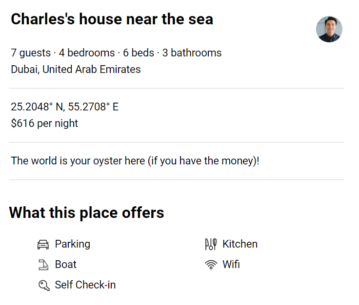
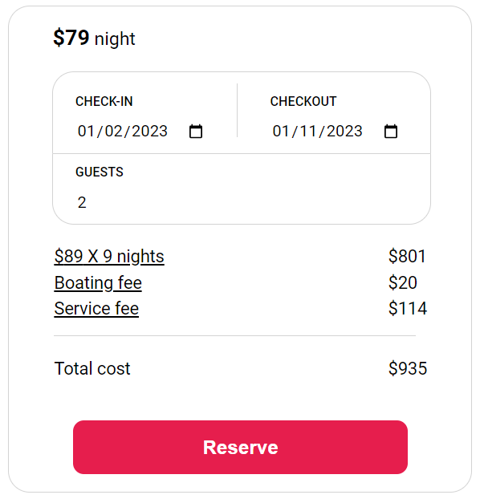
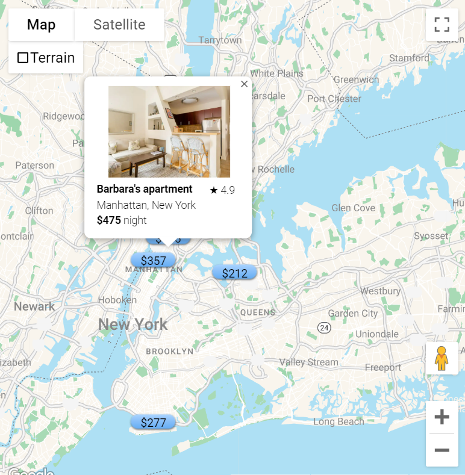
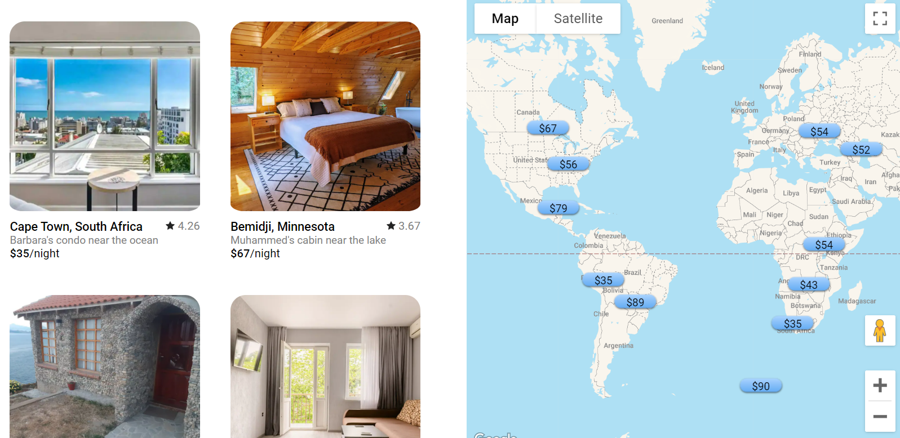

# Fullstack Project: WaterBnB

[WaterBnB](https://waterbnb.onrender.com/) is an affordable water-themed travel booking site -- a clone of AirBnB.  Like AirBnB, WaterBnB allows users to views different listings around the world, make reservations, and leave ratings and reviews.  It uses the Google Maps API to give exact locations and let users search by location.  The splash page is an index of all the listings, with a map centered in New York City by default.


## Technologies and libraries used:
- Ruby on Rails
- JavaScript
- React/Redux
- PostgreSQL
- Google Maps
- Debugger
- Amazon Web Storage (AWS)


## With WaterBnB, users can:

- #### See Listings, with detailed information and photos



Each listing has a show page showing multiple photos, location, ameninities, and other important information.

- #### Reserve listings (CRUD feature), with costs calculated dynamically



Users (who are logged in) can reserve listings and watch as costs change based on their length of stay and number of guests.  This is a full CRUD feature -- users can also read, modify, or cancel reservations for upcoming trips.  The reservations index page shows a user all of their upcoming reservations (from soonest to latest), with basic info, a link to the show page, and buttons to modify and delete.


- #### Search specific locations and see nearby attractions using Google Maps



Users can use Google Maps to search specific locations, with each property having a popup summarizing key information.  Every page uses Google maps, either for or to show the exact location of a specific listing.

The MapContainer object uses locations passed into it that are already fetched elsewhere on the page.  Rather than pass the entire listing object for each location, this passes only the variables the map is going to use (ieither to show in the popup or to filter appropriately):

```
    const locations = []

    for (let i = 0; i < listings.length; i++) {
        locations.push({
            id: listings[i].id,
            title: listings[i].listerName+"'s " + listings[i].buildingType,
            rating: (parseFloat(listings[i].rating).toFixed(1)),
            place: listings[i].city + ', ' + listings[i].country,
            price: listings[i].price,
            pic: listings[i].picturesUrl,
            location: {
                lat: parseFloat(listings[i].latitude),
                lng: parseFloat(listings[i].longitude)
            },
            typeOfWater: listings[i].typeOfWater,
            numberOfRatings: listings[i].numberOfRatings,
            petsAllowed: listings[i].petsAllowed
        })
    }
```


- #### See ratings and reviews; rate/review a property


Users can read reviews of each listing, see ratings, and leave their own ratings/reviews.  This is *not* a full CRUD feature -- like AirBnB, WaterBnB doesn't allow users to delete or modify reviews, because it could create a conflict of interest.  Average rating is stored with each listing and dynamically recalculated whenever a user rates a property.  (For purposes of being a better demo, logged-in users can rate/review any property, but they can't rate/review the same property more than once in a day.)  Here's the calculation:

```
def create
  @review = Review.new(review_params)
  if @review.save
    @listing = Listing.find(@review.listing_id)
    rating = params[:rating]
    @listing.rating = (@review.listing.rating * @review.listing.number_of_ratings + rating) / (@review.listing.number_of_ratings + 1)
    @listing.number_of_ratings += 1
    @listing.save
    render :show
  else
    render json: { errors: @review.errors.full_messages}, status: 422
  end
end
```

Note that people can rate without reviewing (though not vice versa), so most listings have more ratings than reviews.


- #### Filter listings by categories and max price



Rather than looking at all properties at once, users can filter by the body of water it's near (ocean, sea, lake, or falls), by maximum price, or to show only places that allow pets or are highly rated (at least 5 ratings with average of at least 4.75 stars -- that's what the user is looking at currently).  Because filters show fewer listings, the default map with filters is a full world map.

I used different urls to represent different filters, including a catch-all number for maximum price.  (React is fast enough that redirecting isn't a problem, and this stores users' filters in their browser history.)  I filtered it right at the useSelector to prevent errors with undefined variables.

```
const listings = useSelector(getListings)
    .filter((listing) => {
        switch(filter.filter) {
            case 'ocean':
                return listing.typeOfWater == 'ocean' ? listing : null
            case 'lake':
                return listing.typeOfWater == 'lake' || listing.typeOfWater == 'lagoon' ? listing : null
            case 'sea':
                return listing.typeOfWater == 'sea'|| listing.typeOfWater == 'lagoon' ? listing : null
            case 'falls':
                return listing.typeOfWater == 'falls' ? listing : null
            case 'pets':
                return listing.petsAllowed ? listing : null
            case 'popular':
                return listing.numberOfRatings >= 5 && listing.rating >= 4.75 ? listing : null
            default:
                if (parseInt(filter.filter)) {
                    return (listing.price <= parseInt(filter.filter)) ? listing : null
                } else {
                    return listing
                }
        }
    })
```

### This project also includes:
- Extensive seed data
- Photos stored on AWS
- A production README

## Implementation Timeline:
- Friday-Monday: User Authorization
- Tuesday-Friday: Listings
- Saturday-Monday: Reservations
- Tuesday: Google Maps
- Wednesday: Ratings/Reviews
- Thursday: Filters

## Future Features:
- ~~More categories (and more seed data to show them)~~
- Ratings for specific items (location, communication, boat quality, etc.)
- Carousel for photos
- Search function
- CUD functionality for listings
- Recenter default index map based on user's location

## Sources:
- Photos, descriptions, some reviews, and amenity icons taken from AirBnB
- Filter Icons taken from [here](https://www.flaticon.com/)
